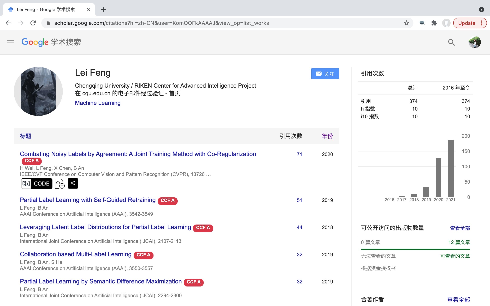

## 保研工具推荐 - 快速查询导师论文发表情况

**致谢：** 感谢刘*炎学姐对本仓库的大力支持！

### 1. 工具作用

帮助学弟学妹比较快地看老师的论文发表情况，自动标注导师论文的CCFrank

Chrome 扩展程序、Firefox 和 Edge 附加组件，在 dblp、Google 学术、Connected Papers 和 Web of Science 的搜索结果中显示中国计算机学会推荐的国际会议和期刊排名。

### 2. 工具下载

开源地址：https://github.com/WenyanLiu/CCFrank4dblp

### 3. 工具效果

